# Consigne

**Objectif** : utiliser les Pull Request pour intégrer des branches de développement 
dans la branche main.

Instructions
 - 1 personne du groupe fork ce dépôt principal
 - la personne qui crée le fork doit ajouter ces collègues comme collaborateur du dépôt
 - les collaborateurs récupèrent le dépôt forké
 - chaque collaborateur crée une branche au format `prenom-nom` à partir du commit initial
 - à partir de sa branche `prenom-nom`, chaque collaborateur va ajouter son prénom/nom à la liste des auteurs dans le fichier `authors.txt` dans un commit
 - chaque collaborateur propage sa branche `prenom-nom` sur le dépôt distant
 - chaque collaborateur crée une Pull Request sur Github pour merger sa branche `prenom-nom` avec la branche `main` distante. Attention : le dépôt de destination du merge est votre dépôt (le fork), pas le dépôt d'origine (créé par l'utilisateur Github `frozar`)
 - chaque collaborateur fait une revue de code dans la Pull Request
 - s'il n'y a pas de modification à faire suite à la revue de code, l'auteur de la Pull Request accepte cette-dernière
 - suite au merge de la première Pull Request, cela va potentiellement générer des conflits sur les autres Pull Request. Pour résoudre ce conflit, l'auteur de la Pull Request doit:
   - mettre à jour sa branche `main` locale
   - récupérer les contributions de sa branche `main` locale dans sa branche `prenom-nom` locale à l'aide d'un merge
   - propager sa branche `prenom-nom` sur le dépôt distant
   - une fois ces étapes réalisées, Github verra que la Pull Request associée à la branche `prenom-nom` ne présente plus de conflit et permettra de l'accepter
 - à la fin de l'activité, le dépôt du groupe doit avoir :
   - un historique avec des ponts qui représentent les différents merges et résolutions de conflits
   - une la branche principale et les branches de développement

Pour se faire, vous aurez besoin de l'ensemble des savoirs des workshops précédents, plus les commandes git suivantes :
 - **push -u** : propager une branche sur un dépôt distant en configurant la branche distante à tracker
 - savoir créer des Pull Requests sur GitHub

Lisez les sections de la "Boite à outils" pour réaliser cet exercice.

## Dans l'historique de commits

Une fois que les différentes branches `prenom-nom` sont créées et propagées sur le 
dépôt distant, vous devriez voir un historique similaire à celui-ci :

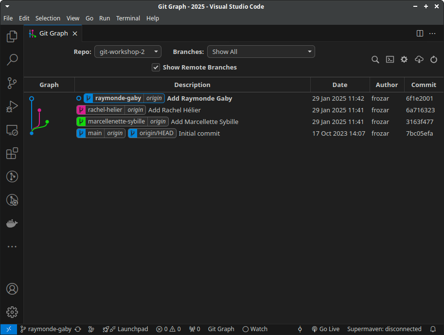

Dans git-graph, la mention `| origin` accolé au nom d'une branche vous permet de savoir
que cette branche a été propagé sur le dépôt distant.

Une fois que toutes les Pull Requests sont acceptées, vous devriez voir un histoirique
similaire à celui-ci, avec les différents ponts représentants les différents merges et 
résolution de conflit :

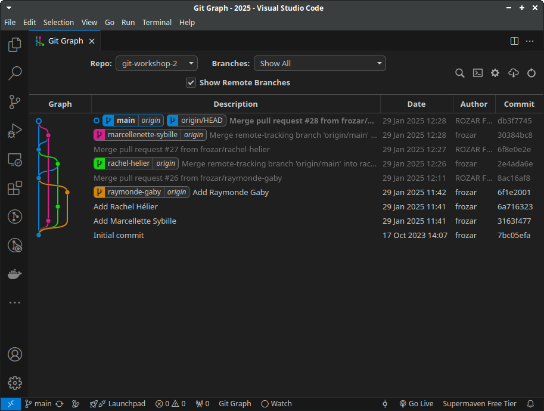

Généralement, après l'acceptation d'une Pull Request, vous n'avez plus
besoin de la branche locale et distante de la branche associée à cette Pull Request.
Je conseille de supprimer les branches qui ne sont plus utiles, locales ou distantes,
après l'acceptation d'une Pull Request.

Visualisez les changements de l'historique des commits après chaque commande git.

## Bilan

Vous savez maintenant travailler à plusieurs sur un dépôt GitHub et utiliser des 
Pull Requests pour intégrer vos contributions à la branche principale. Les efforts
de développement sont maintenant distribués avec le support d'une plateforme en
ligne.

**Remarque 1** : dans ce workflow, la synchronisation entre les développeurs est 
plus souple, mais en contre partie, il y a des conflits à résoudre, de façon 
similaire au workshop précédent.
La différence avec le précédent workshop est que via l'utilisation de Pull Request, 
Github nous informe des potentiels conflits à résoudre. 
Une autre différence est que la résolution de conflits se fait sur la branche 
`prenom-nom`, et non plus sur la branche `main` directement.

**Remarque 2** : la lecture de l'historique de commits devient compliquée. La 
multiplication des ponts entre les branches compliquent l'interprétation des 
différents commits.

# Boite à outils

## Interdire les pushs directement sur la branche main

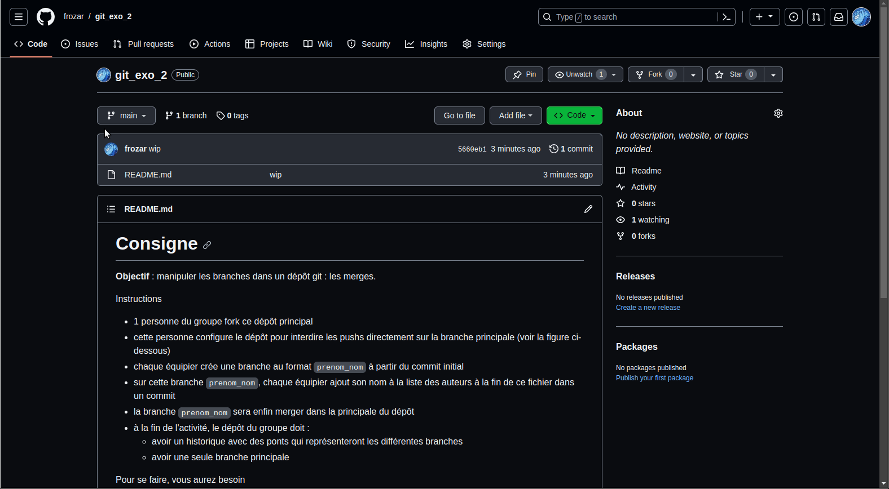

## Comment créer une Pull Request sur GitHub ?

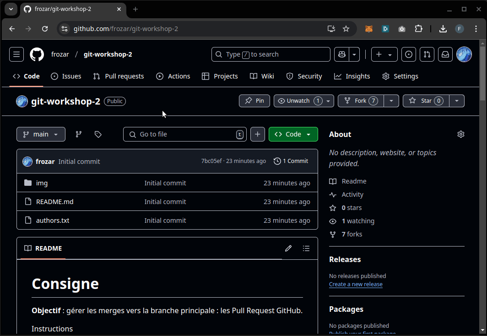

    Astuce :  
    Si peu après avoir fait un push d'une branche sur votre dépôt distant, vous 
    visitez la page Github de votre dépôt, Github vous proposera de créer une Pull 
    Request pour cette branche en cliquant sur le bouton `Compare & pull request`.

## Que permet de faire une revue de code sur une Pull Request ?

Vous pouvez consulter les changements apportées par une branche.

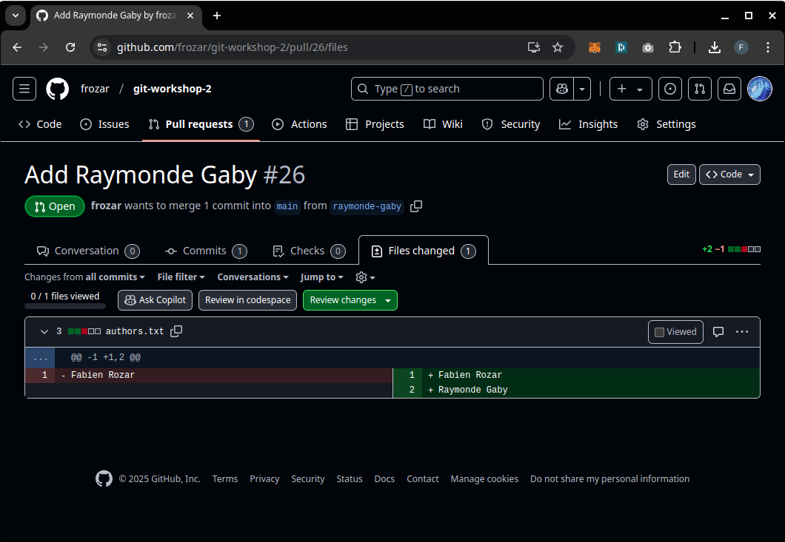

Lors d'une revue de code, vous pouvez mettre des commentaires sur chaque ligne
modifiée. 

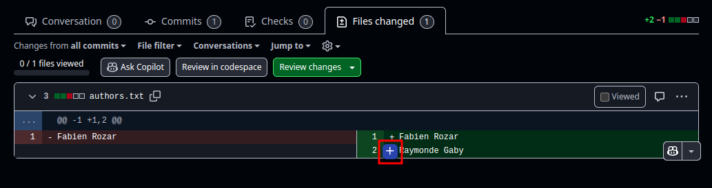

Lorsque vous ajoutez un commentaire, vous pouvez soit l'ajouter avec le bouton
`Add single comment` ou avec `Start a review`. Dans cet exemple, le commentaire
`It's a funny name` a été jouté avec le bouton `Add single comment`.
L'ajout d'un commentaire simple n'a pas pour intention de demander des 
modifications à l'auteur d'un Pull Request. Ce bouton est plutôt utilisé pour 
ouvrir une discussion avec l'auteur de la Pull Request. Un commentaire posté
via ce bouton se retrouvera dans le fils des commentaires sur la page d'accueille
de la Pull Request.

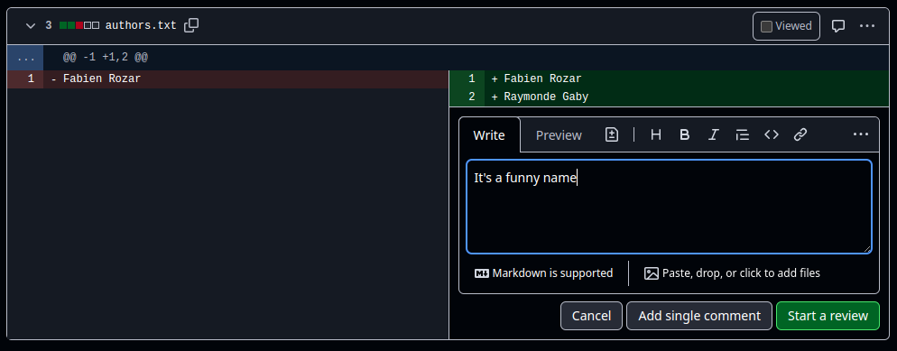

### Soumission d'une revue de code : `review`

Une soumission de code review permet à un collaborateur d'indiquer des changements
à effectuer.

Par contre le commentaire `The list of author should be a bullet list` demande
à l'auteur de la Pull Request d'effectuer des modifications. Il est donc soumis 
avec le bouton `Start a review`. L'utilisation de ce bouton ouvrira ce qu'on
appelle une `review`. Une `review` peut contenir plusieurs commentaires avec
les différentes modifications à apporter pour une Pull Request.

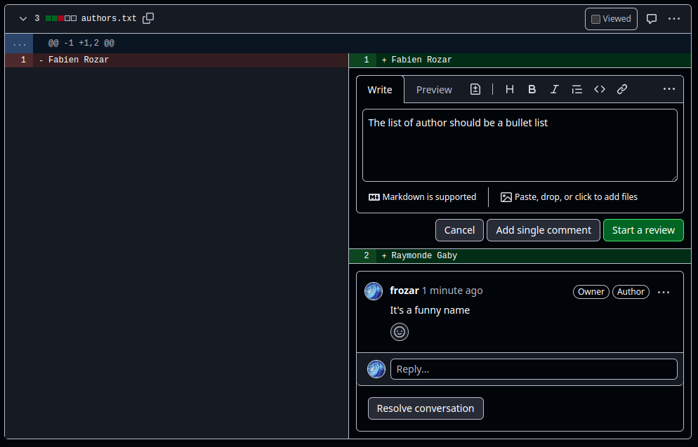

Une fois que vous avez cumulé les différents commentaires de modification,
vous pouvez clôre une `review` en cliquant sur `Finish your review`.

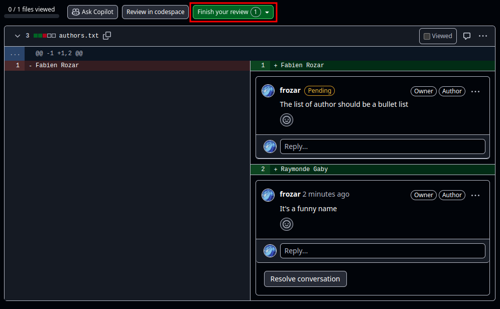

Lorsque vous cliquez sur `Finish your review` la popup suivante s'affiche.
Elle vous permettez de mettre un dernier commentaires globale sur l'ensemble 
des changements à effectuer.

Vous avez 3 options lorsque vous clôturer votre `review` :
 - `Comment` : indique que votre `review` est d'ordre général, sans approbation explicite
 - `Approve` : indique que votre `review` approuve les changements apportés
 - `Request changes` : indique que votre `review` demande à ce que des changements soit fait

En fonction des options choisies pour protéger la branche `main`, l'approbation d'un
collaborateur sur le dépôt peut être requise pour pouvoir accepter une Pull Request.

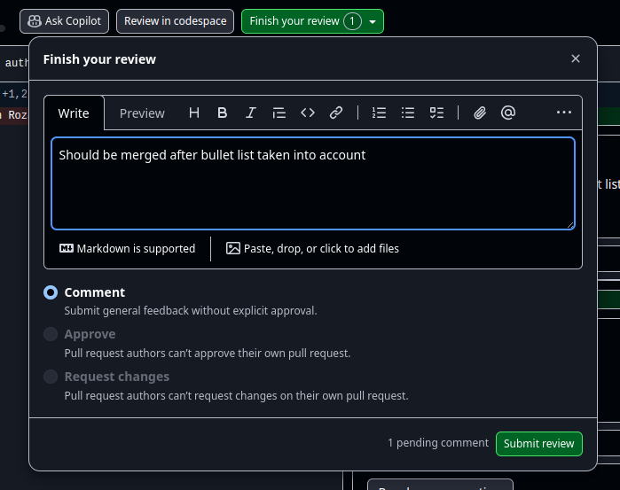

### Réponse à une revue de code

Lorsqu'une `review` est soumise, l'auteur de la Pull Request peut voir les différents
commentaires associés sur la page d'accueil de la Pull Request.

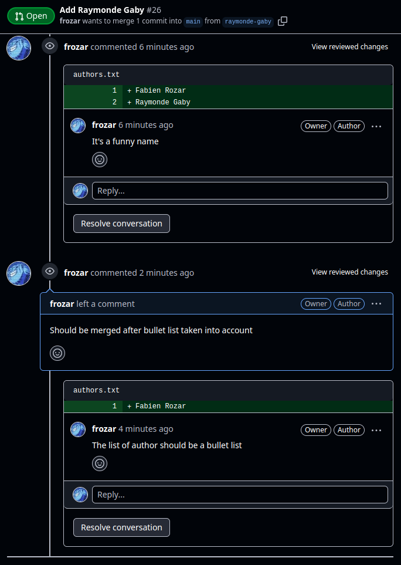

Pour chaque commentaire, l'auteur de la Pull Request peut marquer la conversation
comme résolu en cliquant sur `Resolve conversation`. Cela indique que le commentaire
a été traité. Le traitement d'un commentaire peut être tout simplement un autre 
commentaire ou des modifications de code, cela varia en fonction du contenu du 
commentaire.

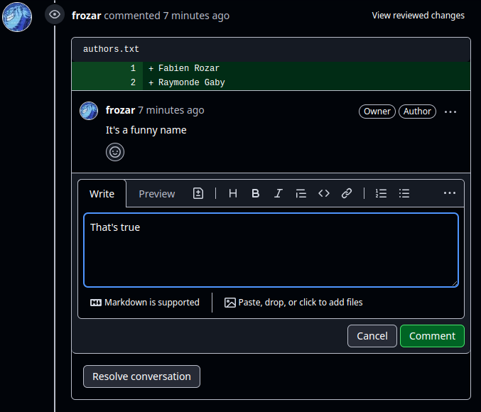

Lorsqu'un commentaire est traité, il apparaît sous la forme réduite suivante :

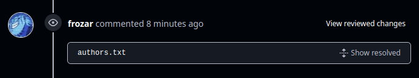

Vous pouvez toutefois consulter le contenu de la résolution d'une discussion en 
cliquant sur `Show resolved`.

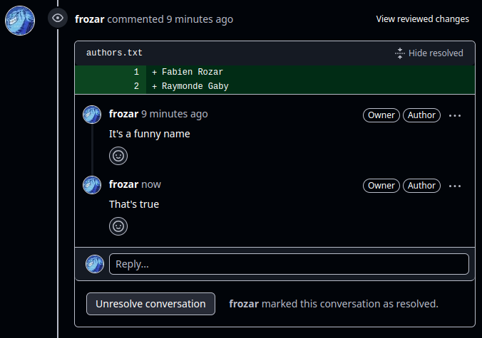

L'objectif de l'auteur de la Pull Request est de résoudre l'ensemble des
commentaires postés sur la Pull Request.

### Commentaire général

Dans une Pull Request, vous pouvez ajouter des commentaires généraux 
directement sur la page d'accueil de la Pull Request.

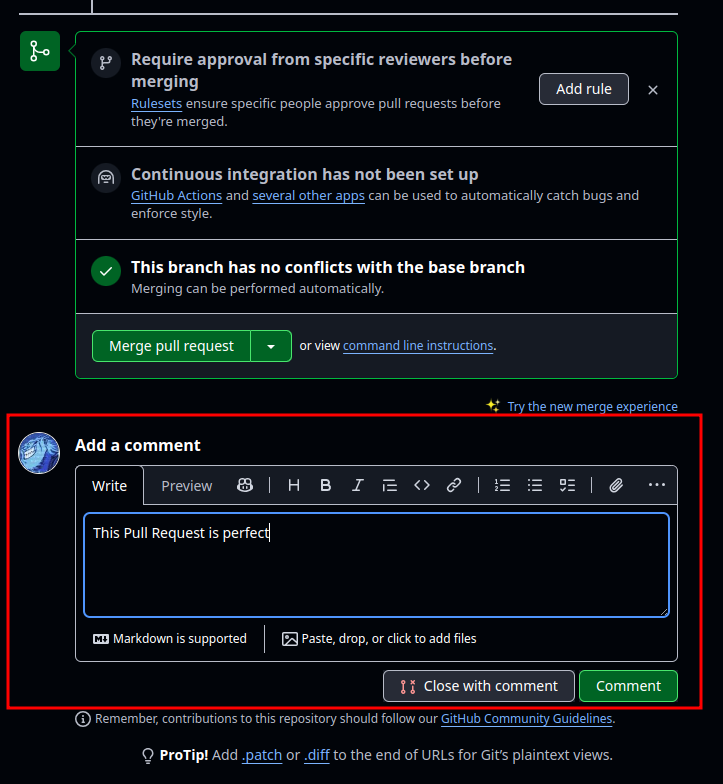 

Un commentaire général se retouve dans le fils des commentaires sur la page d'accueil
de la Pull Request.

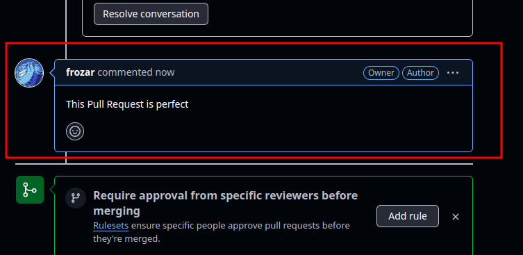 

## Gérer un conflit sur une Pull Resquest

### Notification d'un conflit sur une Pull Resquest

Si la branche que vous souhaitez intégrer dans la branche `main` présente des
conflits avec cette dernière, vous verrez la mention `Can't automatically merge`
lors de la création de la Pull Request.

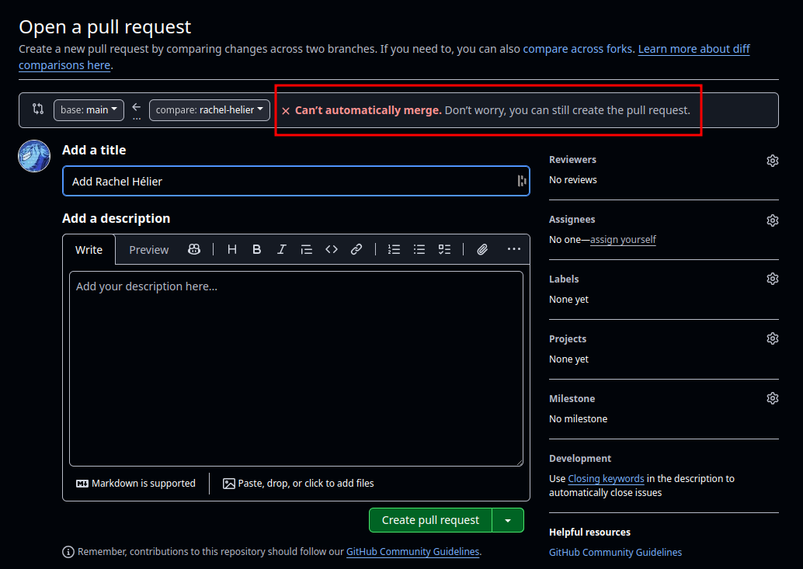

Cette notification de conflit se retouve aussi sur la page d'accueil de la Pull 
Request.

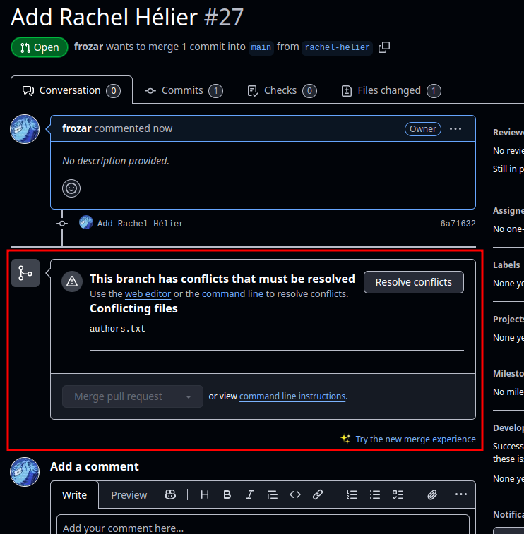

Malgré le fait que Github vous informe de ce conflit, depuis la plateforme vous ne 
verrez pas les différences qui sont en conflit :

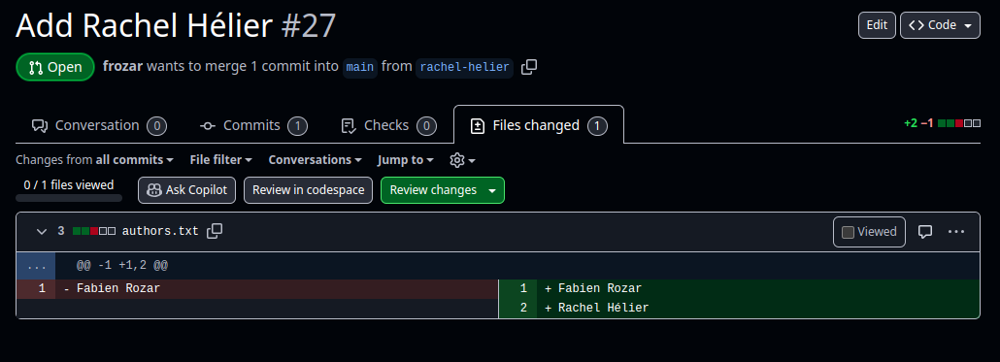

### Résolution d'un conflit pour une Pull Resquest

Pour résoudre un conflit pour une Pull Request, vous devez :
 1. vous placer sur votre branche `main` : `git switch main`
 2. mettre à jour votre branche `main` locale : `git pull`
 3. vous placer sur votre branche `prenom-nom` : `git switch prenom-nom`
 4. merger les contributions de votre branche `main` dans votre branche `prenom-nom` : `git merge main`
 5. à ce moment, git vous indiquera que vous avez des conflits à résoudre
 6. résoudre les conflits : voir la section "La résolution de conflit" du workshop précédent
 7. propager votre branche `prenom-nom` sur le dépôt distant : `git push`

Après la resolution d'un conflit, vous devez voir un pont représentant votre résolution
dans le git-graph.

    Astuce :  
    Pour récupérer les mise à jour du dépôt, vous pouvez utiliser `git fetch` qui 
    mettra à jour vos références locales de branche distante. Une fois que votre
    référence locale `origin/main` est à jour (cette commande remplace les étapes
    1. et 2. ci-dessus), à l'étape 4. vous pouvez utiliser la commande 
    `git merge origin/main`


Si votre résolution de conflit est effective, Github vous indiquera que vous
avez la possibilité d'accepter votre Pull Request.


## Comment supprimer une branche distante ?

### Via Github

Après l'acception d'une Pull Request, vous n'avez plus besoin de la branche
distante associée à cette Pull Request. Github vous permet de la supprimer :

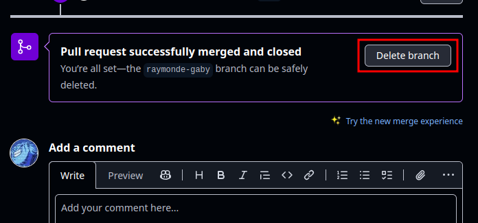

**Subtilité par rapport aux références locales de branches distantes**

Lorsqu'une branche distante est supprimée, vous avez toujours une référence locale 
vers cette branche, `origin/<nom-de-branche>`. Même après avoir fait un `git fetch`,
cette référence ne disparaît pas.  
Ce comportement est dû au caractère conservateur de git. Ce choix se justifie dans
le cas de figure suivant. Dans le cas où une branche distante a été supprimée par 
erreur par un collaborateur, si un des collaborateur du dépôt a fait un  
`git fetch` alors que la branche existait encore sur le dépôt distant, alors
ce collaborateur a une référence locale de cette branche distante (qui a été supprimée).
Il est possible pour ce collaborateur de restorer cette branche qui a été supprimée
par erreur.

Dans le cas où vous avez supprimer une branche distante suite à l'acceptation 
d'une Pull Request, vous n'avez plus besoin de cette référence locale. 
Vous pouvez la supprimer avec la commande `git fetch -p`. L'option `-p` permet
de supprimer les références locales de branches qui n'existent plus sur le 
dépôt distant. 

### Depuis votre ordinateur de travail

Si vous n'avez pas demandé la suppression de la branche distante lors de la Pull 
Request, vous avez certainement plusieurs branches qui sont toujours présentent sur 
votre dépôt distant alors qu'elles ont été mergées dans la branche main. Vous pouvez le 
voir dans git-graph avec la mention `| origin` accolé au nom des branches.

Pour supprimer une branche sur votre dépôt distant, vous pouvez taper :
```
git push origin :<nom-de-branche>
```
